**Alunma: Yorka Munchuli**

**Profesor: Víctor Recio**

**Curso: 5to A de informática**

**Materia: Base de Datos**

**Fecha: 21/5/2025**

#

# 🗒️Reportes en C# y PHP
Preguntas claves:

**1.	¿Cómo se crean los reportes para ambos lenguajes?**


La forma más común de crear reportes estructurados en C# implica usar Microsoft Reporting Services (RDL), especialmente con el Diseñador de Informes de Visual Studio.
Usando el Diseñador de Informes de Visual Studio (reportes .rdlc):

✔️**1.	Agregar un Elemento de Informe:**
En el proyecto de C# (por ejemplo, Windows Forms o ASP.NET), normalmente se agrega un nuevo elemento de tipo "Informe" (esto crea un archivo .rdlc). Antes de esto, instalar un paquete para que salga en el “Cuadro de herramientas”.


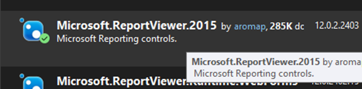


**En este caso:**
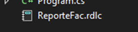

✔️**2.	Diseñar el Diseño del Informe:**
El Diseñador de Informes proporciona un lienzo visual donde se puede arrastrar y soltar elementos de informe como Cuadros de Texto, Tablas, Gráficos, Imágenes, etc. Se define visualmente el diseño y la apariencia del informe.

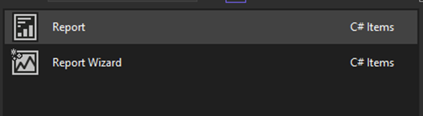
✔️**3.	Conectar a Datos:**

Se configura una fuente de datos, es decir usar una base de datos donde se presente los datos a mostrar en el reporte.


✔️**4.	Vincular Datos a Elementos del Informe:**
Para elementos como Tablas y Gráficos, se vincula a los conjuntos de datos que han sido creados. Para los Cuadros de Texto, se muestran campos específicos de los datos o valores calculados usando expresiones. Es decir, colocar nombres descriptivos para los **labels y textbox** para el código a futuro.

✔️**5.	Usar el Control ReportViewer:**

En el Formulario o página ASP.NET, se agrega un control ReportViewer. En el código subyacente (archivo .cs), cargarás el archivo .rdlc en el ReportViewer, establecerás la fuente de datos y actualizarás el informe.

*Ejemplo:*
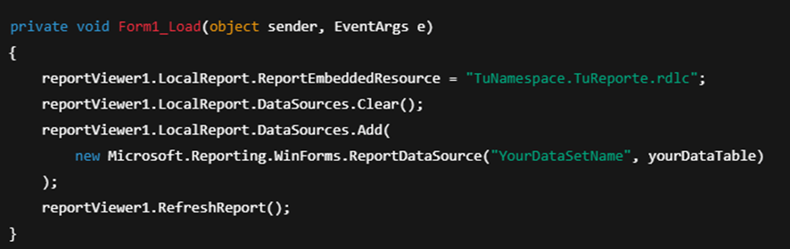 
 *Se sustituye "TuNamespace.TuReporte.rdlc" por los nombres reales. Y también, "YourDataSetName".*

# 🗒️Reportes en el PHP
En PHP, la creación de reportes a menudo implica usar librerías para generar formatos de documentos específicos o creando HTML que se puede imprimir o guardar como PDF.
Para la creación de un reporte en PHP, lo primero y primordial es incluir librerías de PDF, estas deben de esta incluidas dentro del proyecto. 

En mi caso use FPDF:

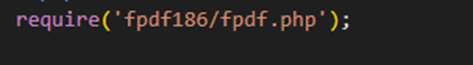

**En la parte de diseño:**

Se agregan nuevas páginas al PDF, se establecen fuentes. Usando métodos como Write(), Cell(), MultiCell(), writeHTML() para agregar texto, tablas y otros elementos, tomando datos de tus variables de PHP o resultados de la base de datos. 

🔎*Ejemplo:*

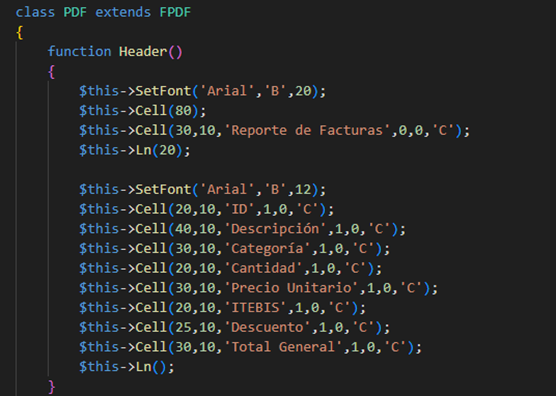

 
✔️**2.	¿Cuál es la importancia de los reportes?**

Los reportes son herramientas fundamentales que permiten **organizar y presentar información** de manera clara y estructurada. Su importancia radica en que facilitan **la toma de decisiones** al ofrecer datos concretos y relevantes, resumiendo información compleja de forma comprensible. Además, **permiten dar seguimiento a proyectos, evaluar resultados, fomentar la transparencia y rendición de cuentas**, así como planificar futuras acciones con base en evidencias. En contextos académicos, empresariales o institucionales, los reportes cumplen una función clave al **documentar procesos** y resultados, convirtiéndose en una guía confiable para el análisis y la mejora continua.

# 🗒️Practica:
1.	Cree un formulario que genere un reporte en c# que imprima los datos de una factura. [ID, DESCRIPCIÓN, CATEGORÍA, CANTIDAD, PRECIO_UNITARIO, ITEBIS, DESCUENTO, TOTAL_GENERAL]

**La base de datos:**


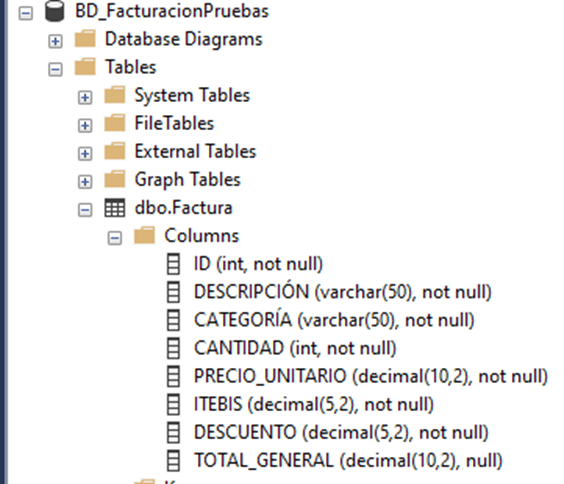


## **Registros:**

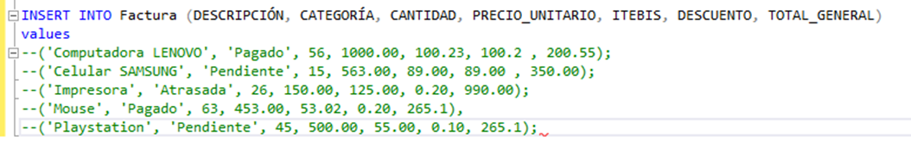

## Proceso en Visual Studio:

```csharp

using Microsoft.Reporting.WebForms;
using Microsoft.Reporting.WinForms;
using System;
using System.Data;
using System.Data.SqlClient;
using System.Drawing;
using System.Windows.Forms;
using Reporte_Factura;

namespace Reporte_Factura
{
    public partial class Form1 : Form
    {
        string connectionString = @"Server=DESKTOP-37K1NF5\SQLEXPRESS;Database=BD_FacturacionPruebas;Integrated Security=True;";
        private SqlDataAdapter dataAdapter;
        private DataTable dataTable;
        public Form1()
        {
            InitializeComponent();
        }

        private void Form1_Load(object sender, EventArgs e)
        {
            // TODO: This line of code loads data into the 'bD_FacturacionPruebasDataSet.Factura' table. You can move, or remove it, as needed.
            this.facturaTableAdapter.Fill(this.bD_FacturacionPruebasDataSet.Factura);
            LoadData();
            //this.reportViewer1.RefreshReport();
        }

        private void LoadData()
        {
            try
            {
                using (SqlConnection connection = new SqlConnection(connectionString))
                {
                    string query = "SELECT ID, DESCRIPCIÓN, CATEGORÍA, CANTIDAD, PRECIO_UNITARIO, ITEBIS, DESCUENTO, TOTAL_GENERAL FROM Factura";
                    dataAdapter = new SqlDataAdapter(query, connection);
                    dataTable = new DataTable();
                    dataAdapter.Fill(dataTable);
                    dataGridView1.DataSource = dataTable;
                }
            }
            catch (Exception ex)
            {
                MessageBox.Show("Error al cargar los datos: " + ex.Message);
            }
        }

        private DataTable GetDataFromDatabase()
        {
            DataTable dt = new DataTable();
            try
            {
                using (SqlConnection connection = new SqlConnection(connectionString))
                {
                    connection.Open();
                    string query = "SELECT ID, DESCRIPCIÓN, CATEGORÍA, CANTIDAD, PRECIO_UNITARIO, ITEBIS, DESCUENTO, TOTAL_GENERAL FROM Factura";
                    SqlDataAdapter adapter = new SqlDataAdapter(query, connection);
                    adapter.Fill(dt);
                }
            }
            catch (Exception ex)
            {
                MessageBox.Show("Error al cargar datos de la base de datos: " + ex.Message);
            }
            return dt;
        }

        private void btnGenerarReporte_Click(object sender, EventArgs e)
        {
            
        }

        private void reportViewer1_Load(object sender, EventArgs e)
        {
        }

        private void GenerarReporte()
        {
          
        }

        private void btnguardar_Click(object sender, EventArgs e)
        {
            string descripcion = txtDescripcion.Text;
            string categoria = txtCategoria.Text;
            if (!int.TryParse(txtCantidad.Text, out int cantidad)) { MessageBox.Show("Cantidad debe ser un número."); return; }
            if (!decimal.TryParse(txtPrecioUnitario.Text, out decimal precioUnitario)) { MessageBox.Show("Precio Unitario debe ser un número."); return; }
            if (!decimal.TryParse(txtItebis.Text, out decimal itebis)) { MessageBox.Show("ITEBIS debe ser un número."); return; }
            if (!decimal.TryParse(txtDescuento.Text, out decimal descuento)) { MessageBox.Show("Descuento debe ser un número."); return; }
            if (!decimal.TryParse(txtTotalGeneral.Text, out decimal totalGeneral)) { MessageBox.Show("Total General debe ser un número."); return; }

            string query = "INSERT INTO Factura (DESCRIPCIÓN, CATEGORÍA, CANTIDAD, PRECIO_UNITARIO, ITEBIS, DESCUENTO, TOTAL_GENERAL) " +
                           "VALUES (@Descripcion, @Categoria, @Cantidad, @PrecioUnitario, @Itebis, @Descuento, @TotalGeneral)";

            using (SqlConnection connection = new SqlConnection(connectionString))
            {
                using (SqlCommand command = new SqlCommand(query, connection))
                {
                    command.Parameters.AddWithValue("@Descripcion", descripcion);
                    command.Parameters.AddWithValue("@Categoria", categoria);
                    command.Parameters.AddWithValue("@Cantidad", cantidad);
                    command.Parameters.AddWithValue("@PrecioUnitario", precioUnitario);
                    command.Parameters.AddWithValue("@Itebis", itebis);
                    command.Parameters.AddWithValue("@Descuento", descuento);
                    command.Parameters.AddWithValue("@TotalGeneral", totalGeneral);

                    {
                        try
                        {
                            connection.Open();
                            int rowsAffected = command.ExecuteNonQuery();
                            if (rowsAffected > 0)
                            {
                                MessageBox.Show("Registro añadido correctamente.");
                                
                                LoadData();
                               
                                GenerarReporte();
                              
                                LimpiarCamposEntrada();
                            }
                            else
                            {
                                MessageBox.Show("Error al añadir el registro.");
                            }
                        }
                        catch (Exception ex)
                        {
                            MessageBox.Show("Error al conectar o ejecutar la consulta: " + ex.Message);
                        }
                    }
                }
            }  }
            
     
       
    public TextBox TxtDescripcion { get; set; }
        public TextBox TxtCategoria { get; set; }
        public TextBox TxtCantidad { get; set; }
        public TextBox TxtPrecioUnitario { get; set; }
        public TextBox TxtItebis { get; set; }
        public TextBox TxtDescuento { get; set; }
        public TextBox TxtTotalGeneral { get; set; }


        private void LimpiarCamposEntrada()
        {
            txtDescripcion.Text = "";
            txtCategoria.Text = "";
            txtCantidad.Text = "";
            txtDescuento.Text = "";
            txtItebis.Text = "";
            txtid.Text =  "";
            txtTotalGeneral.Text = "";
        }

        private void btnverreporte_Click(object sender, EventArgs e)
        {
            Form3 form = new Form3();
            form.ShowDialog();
        }
    }
}

<div align="center"><b>Para el DataGridView:</b></div>

En el cuadro de herramienta se añade el control de DataGridView.

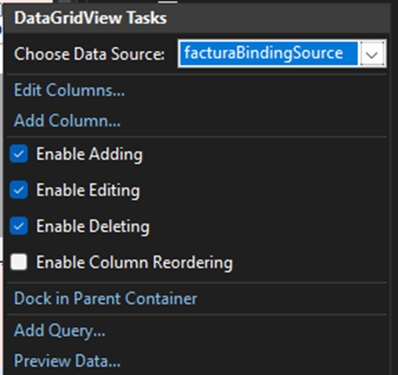

```
**Para el DataGridView**


<br>


Aquí se hace la conexión de la tabla *“Factura”*, para que aparezca en el DataGrid.
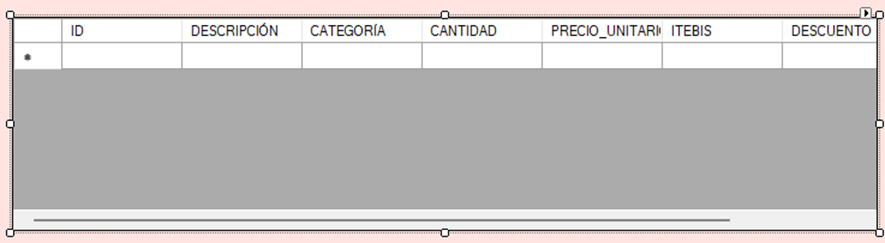

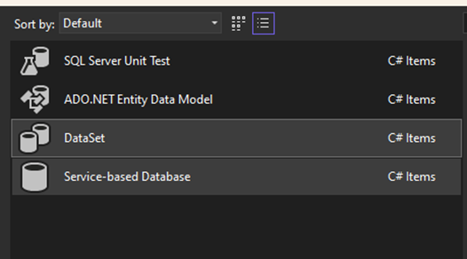
Se  crea automaticamente el espacio para hacer el *"TableAdapter"*.
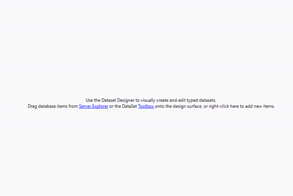

Luego, en el mismo espacio hacemos click derecho, para agrgar *"TableAdapter"*.
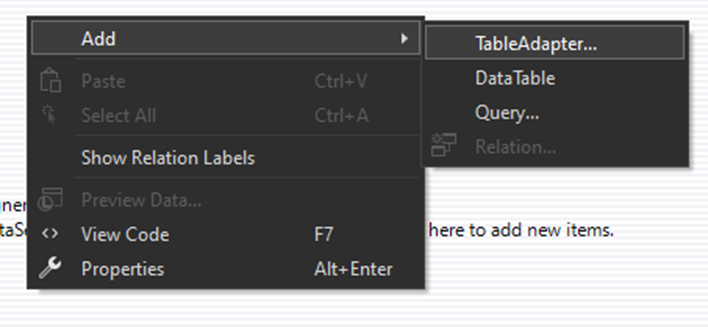

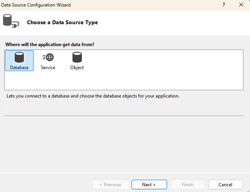

Se hace la conexión con la base de datos.
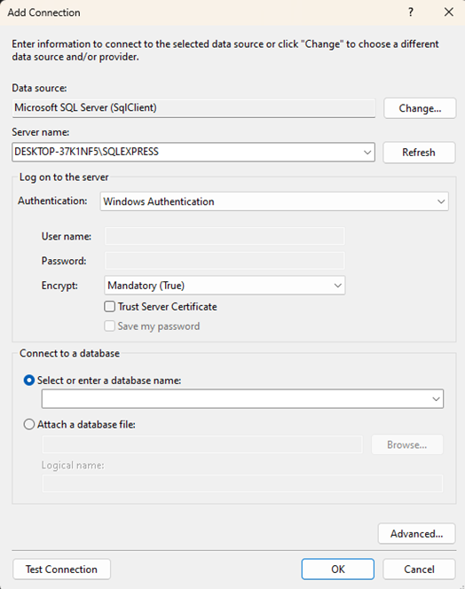


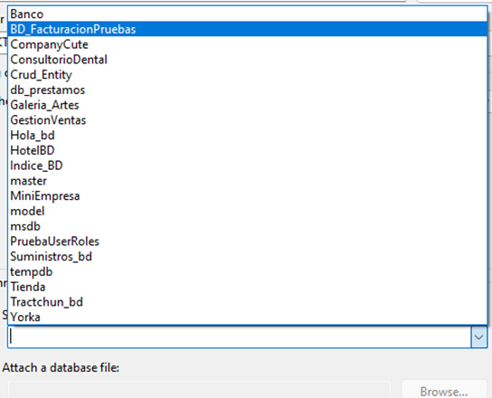

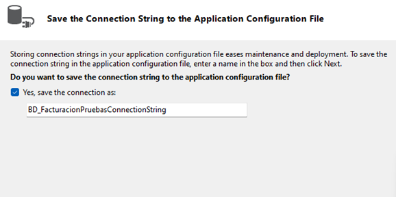

En la parte inferior se vizualiza en nombre del *DataSet*.
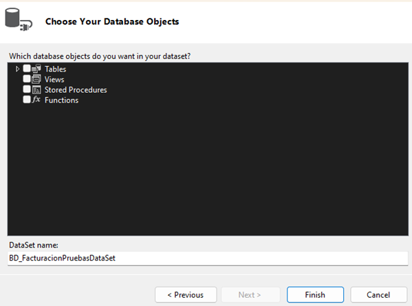

### 🔎Aparicion de la tabla *"Factura"* con sus tablas y campos.

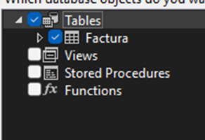


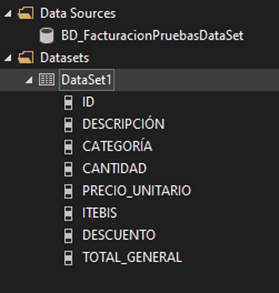

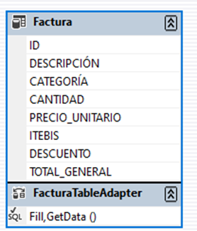

## ✔️Componentes:
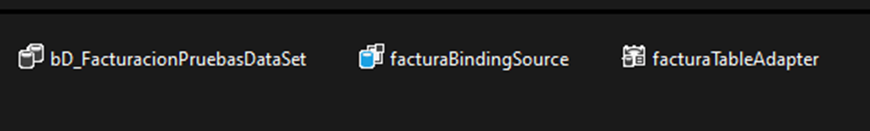

## ✔️ Reporte creado con la conexión de la tabla “Factura”
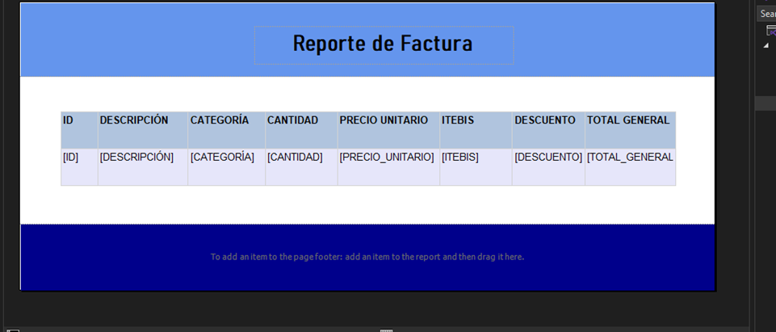

## ✔️ Formulario aparte para que se muestre mi reporte
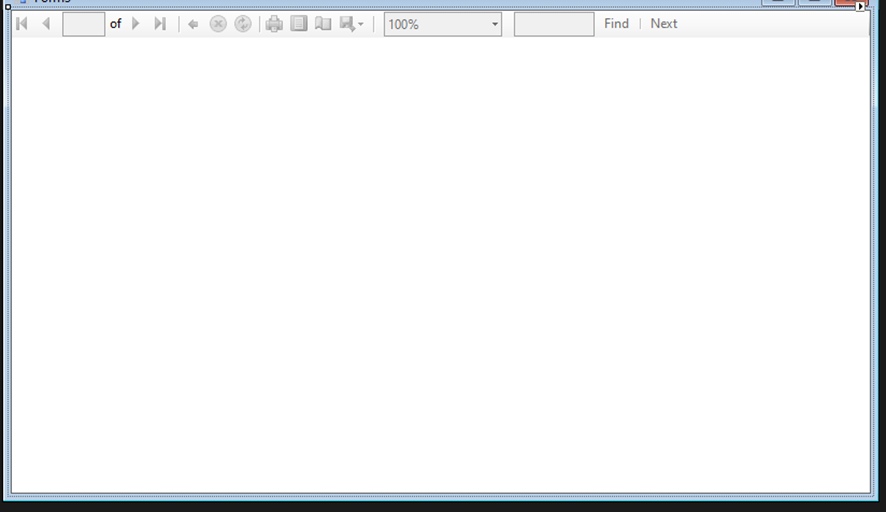

## 📝 Código por default


## 📝 Formulario del DataGridView
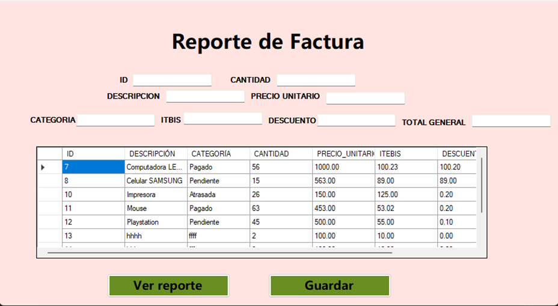

📋Al hacer click, en el boton *"Ver reporte"* se muestra el form del reporte.

📋 Al hacer click, en el boton *"Guardar"* se guardan el registro y lo envía a la base de datos.

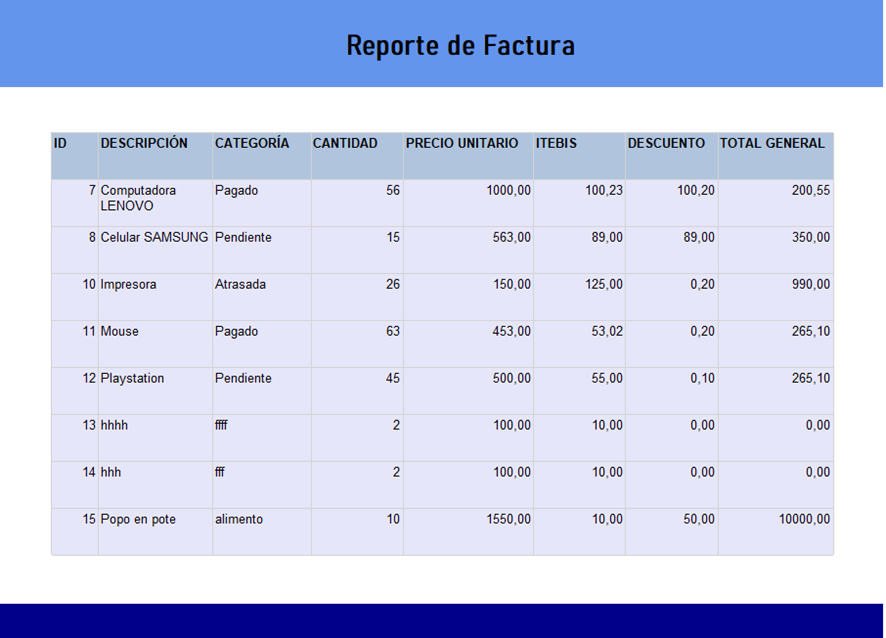
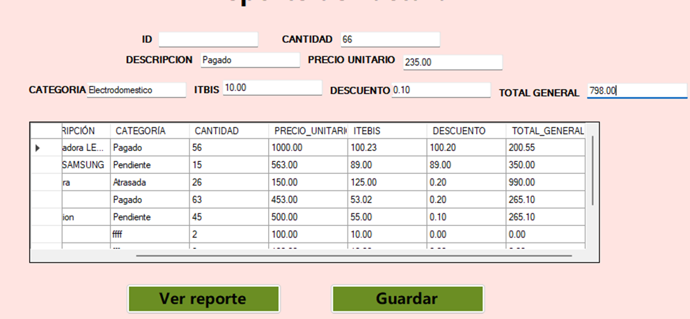
Registro añadido con exito en el DataGrid.
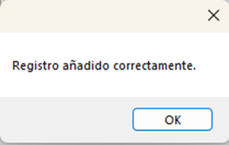
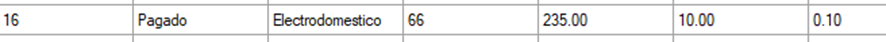

**En la base de datos...**
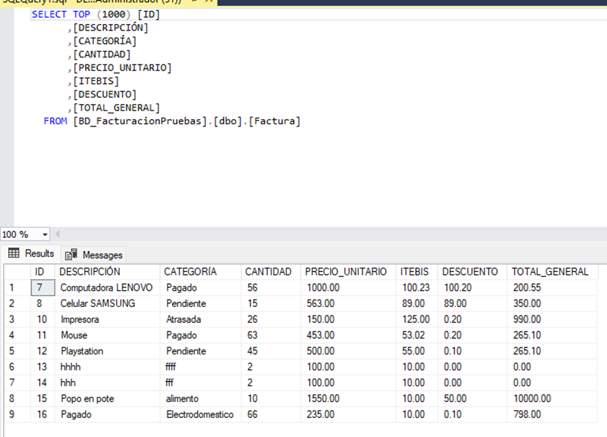

# 🗒️Practica:

2.	Cree un formulario que genere un reporte en PHP que imprima los datos de una factura. [ID, DESCRIPCIÓN, CATEGORÍA, CANTIDAD, PRECIO_UNITARIO, ITEBIS, DESCUENTO, TOTAL_GENERAL]

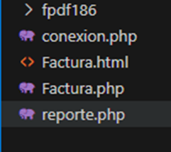

*En la imagen se muestra los archivos creados, como por ejemplo, el archivo del formulario (HTML), su PHP, entre otros.*


# 📝 Código del HTML:


```csharp
<!DOCTYPE html>
<html lang="en">
<head>
    <meta charset="UTF-8">
    <meta name="viewport" content="width=device-width, initial-scale=1.0">
    <title>Factura</title>
    <style>
        body {
            font-family: 'Segoe UI', Tahoma, Geneva, Verdana, sans-serif;
            background-color: #ffe0b2;
            display: flex;
            justify-content: center;
            align-items: center;
            min-height: 100vh;
            margin: 0;
            background-image: linear-gradient(135deg, #ffe0b2, #9c67ff);
        }

        .forms-container {
            width: 90%;
            max-width: 600px;
        }

        .form-section {
            background: rgba(255, 255, 255, 0.9);
            padding: 30px;
            border-radius: 10px;
            box-shadow: 0 4px 10px rgba(0, 0, 0, 0.1);
            margin: 20px auto;
        }

        h1 {
            color: #8e4eb3;
            text-align: center;
            margin-bottom: 25px;
            font-size: 24px;
            font-weight: 600;
            text-transform: uppercase;
            letter-spacing: 1px;
        }

        label {
            display: block;
            margin-bottom: 6px;
            color: #333;
            font-weight: 500;
            font-size: 14px;
        }

        input[type="text"],
        input[type="number"],
        input[type="datetime"],
        select {
            width: calc(100% - 22px);
            padding: 10px;
            margin-bottom: 15px;
            font-size: 14px;
            border: 1px solid #ccc;
            border-radius: 5px;
            box-sizing: border-box;
            transition: border-color 0.3s ease;
        }

        input[type="text"]:focus,
        input[type="number"]:focus,
        input[type="datetime"]:focus,
        select:focus {
            border-color: #480c97;
            outline: none;
            box-shadow: 0 0 5px rgba(255, 152, 0, 0.3);
        }

        button, input[type="submit"] {
            background-color: #b882ff;
            color: rgb(28, 2, 41);
            padding: 12px 20px;
            border: none;
            border-radius: 5px;
            font-size: 16px;
            width: 100%;
            cursor: pointer;
            transition: background-color 0.3s ease, transform 0.2s ease;
            box-shadow: 0 2px 5px rgba(0, 0, 0, 0.15);
            margin-top: 15px;
            font-weight: 600;
        }

        button:hover, input[type="submit"]:hover {
            background-color: #370a55;
            transform: translateY(-2px);
            box-shadow: 0 3px 7px rgba(0, 0, 0, 0.2);
        }

        .input-group {
            margin-bottom: 15px;
        }

        .input-group label {
            margin-bottom: 5px;
        }

        select {
            appearance: none;
            background-image: url('data:image/svg+xml;utf8,<svg fill="black" height="24" viewBox="0 0 24 24" width="24" xmlns="http://www.w3.org/2000/svg"><path d="M7 10l5 5 5-5z"/><path d="M0 0h24v24H0z" fill="none"/></svg>');
            background-repeat: no-repeat;
            background-position: right 10px top 50%;
            padding-right: 30px;
        }

        input[type="checkbox"] {
            display: inline-block;
            margin-right: 5px;
            vertical-align: middle;
        }

        label[for^="Tipo_cliente"] {
            display: inline-block;
            margin-right: 15px;
            vertical-align: middle;
        }
    </style>
</head>
<body>
    <div class="forms-container">
        <div class="form-section">
            <form action="Factura.php" method="POST">
                <h1>Formulario de Factura</h1>

                <label for="ID">ID_Factura</label>
                <input type="text" id="ID" name="ID" required placeholder="ID">

                <label for="DESCRIPCIÓN">DESCRIPCIÓN</label>
                <input type="text" id="DESCRIPCIÓN" name="DESCRIPCIÓN" required placeholder="DESCRIPCIÓN">

                <label for="CATEGORÍA">CATEGORÍA</label>
                <input type="text" id="CATEGORÍA" name="CATEGORÍA" required placeholder="CATEGORÍA">

                <label for="CANTIDAD">CANTIDAD </label>
                <input type="text" id="CANTIDAD" name="CANTIDAD" required placeholder="CANTIDAD">

                <label for="PRECIO_UNITARIO">PRECIO_UNITARIO</label>
                <input type="text" id="PRECIO_UNITARIO" name="PRECIO_UNITARIO" required placeholder="PRECIO_UNITARIO">

                <label for="ITEBIS">ITEBIS</label>
                <input type="text" id="ITEBIS" name="ITEBIS" required placeholder="ITEBIS">

                <label for="DESCUENTO">DESCUENTO</label>
                <input type="text" id="DESCUENTO" name="DESCUENTO" required placeholder="DESCUENTO">

                <label for="TOTAL_GENERAL">TOTAL_GENERAL</label>
                <input type="text" id="TOTAL_GENERAL" name="TOTAL_GENERAL" required placeholder="TOTAL_GENERAL">

    
                <input type="submit" value="Enviar datos y guardar">
             
            </form>
        </div>
    </div>
</body>
</html>

```

# 📝 Código del PHP:


```csharp
<?php
// include 'Conexion.php'; // Parece que esta línea no es necesaria ya que defines la conexión aquí

$servername = "DESKTOP-37K1NF5\\SQLEXPRESS";
$connectionInfo = array("Database" => "BD_FacturacionPruebas", "UID" => "YorkaRoles", "PWD" => "2658");
$conn = sqlsrv_connect($servername, $connectionInfo);

if (!$conn) {
    die("Error en la conexión: " . print_r(sqlsrv_errors(), true));
}

if ($_SERVER["REQUEST_METHOD"] == "POST") {
    $ID = $_POST["ID"];
    $DESCRIPCIÓN = $_POST["DESCRIPCIÓN"];
    $CATEGORÍA = $_POST["CATEGORÍA"];
    $CANTIDAD = $_POST["CANTIDAD"];
    $PRECIO_UNITARIO = $_POST["PRECIO_UNITARIO"];
    $ITEBIS = $_POST["ITEBIS"];
    $DESCUENTO = $_POST["DESCUENTO"];
    $TOTAL_GENERAL = $_POST["TOTAL_GENERAL"];

    if (empty($ID) || empty($DESCRIPCIÓN) || empty($CATEGORÍA) || empty($CANTIDAD) || empty($PRECIO_UNITARIO) || empty($ITEBIS) || empty($DESCUENTO) || empty($TOTAL_GENERAL) )
    {
        echo "Error: Todos los campos obligatorios deben estar llenos.";
    } else {
        $sql = "INSERT INTO Factura ( ID, DESCRIPCIÓN, CATEGORÍA, CANTIDAD, PRECIO_UNITARIO, ITEBIS, DESCUENTO, TOTAL_GENERAL) VALUES ( ?, ?, ?, ?, ?, ?, ?, ?)";
        $params = array($ID, $DESCRIPCIÓN, $CATEGORÍA, $CANTIDAD, $PRECIO_UNITARIO, $ITEBIS, $DESCUENTO, $TOTAL_GENERAL);
        $stmt = sqlsrv_query($conn, $sql, $params);

        if ($stmt) {
            echo "Datos guardados correctamente.";
            sqlsrv_free_stmt($stmt);
        } else {
            echo "Error al guardar datos: " . print_r(sqlsrv_errors(), true);
        }
    }
}

sqlsrv_close($conn);
?>
```

# 📝 Para la conexión con la base de datos:
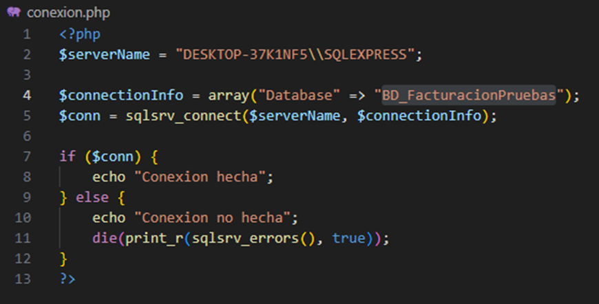

## ✔️ Para el reporte...
Primero incluyo a mi proyecto la librería de FPDF para la creacion de mi reporte, exiten otras pero esta fue es la de mi preferencia.

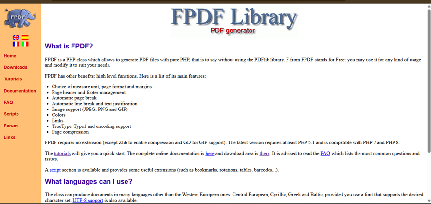


**La descargo, lo descomprimo, y luego lo llevo a dentro de mi proyecto.**
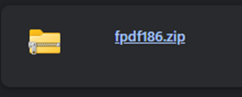

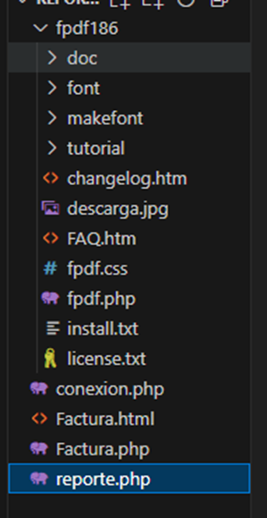

# 📝 Código del reporte y su diseño:
```csharp
<?php
require('fpdf186/fpdf.php');

$servername = "DESKTOP-37K1NF5\\SQLEXPRESS";
$connectionInfo = array( "Database" => "BD_FacturacionPruebas", "UID" => "YorkaRoles", "PWD" => "2658", "CharacterSet" => "UTF-8");

$conn = sqlsrv_connect( $servername, $connectionInfo);

if( $conn === false ) {
     die( print_r( sqlsrv_errors(), true));
}

$sql = "SELECT ID, DESCRIPCIÓN, CATEGORÍA, CANTIDAD, PRECIO_UNITARIO, ITEBIS, DESCUENTO, TOTAL_GENERAL FROM Factura";
$stmt = sqlsrv_query( $conn, $sql );

if( $stmt === false) {
    die( print_r( sqlsrv_errors(), true));
}

$facturas = array();
while( $row = sqlsrv_fetch_array( $stmt, SQLSRV_FETCH_ASSOC) ) {
    $facturas[] = $row;
}

sqlsrv_free_stmt( $stmt);

class PDF extends FPDF
{
    function Header()
    {
        $this->SetFont('Arial','B',20);
        $this->Cell(80);
        $this->Cell(30,10,'Reporte de Facturas',0,0,'C');
        $this->Ln(20);

        $this->SetFont('Arial','B',12);
        $this->Cell(20,10,'ID',1,0,'C');
        $this->Cell(40,10,'Descripción',1,0,'C');
        $this->Cell(30,10,'Categoría',1,0,'C');
        $this->Cell(20,10,'Cantidad',1,0,'C');
        $this->Cell(30,10,'Precio Unitario',1,0,'C');
        $this->Cell(20,10,'ITEBIS',1,0,'C');
        $this->Cell(25,10,'Descuento',1,0,'C');
        $this->Cell(30,10,'Total General',1,0,'C');
        $this->Ln();
    }

    function Footer()
    {
        $this->SetY(-15);
        $this->SetFont('Arial','I',8);
        $this->Cell(0,10,'Página '.$this->PageNo().'/{nb}',0,0,'C');
    }

    function facturaRow($row)
    {
        $this->SetFont('Arial','',10);
        $this->Cell(20,8,$row['ID'],1,0,'C');
        $this->Cell(40,8,$row['DESCRIPCIÓN'],1,0,'L');
        $this->Cell(30,8,$row['CATEGORÍA'],1,0,'L');
        $this->Cell(20,8,$row['CANTIDAD'],1,0,'C');
        $this->Cell(30,8,number_format($row['PRECIO_UNITARIO'], 2),1,0,'R');
        $this->Cell(20,8,number_format($row['ITEBIS'], 2),1,0,'R');
        $this->Cell(25,8,number_format($row['DESCUENTO'], 2),1,0,'R');
        $this->Cell(30,8,number_format($row['TOTAL_GENERAL'], 2),1,0,'R');
        $this->Ln();
    }
}

$pdf = new PDF();
$pdf->AliasNbPages();
$pdf->AddPage('L'); 

foreach ($facturas as $factura) {
    $pdf->facturaRow($factura);
}

$pdf->Output();

sqlsrv_close( $conn );

?>
```

# 👓Visualmente:
### En esta imagen se muestra el PDF con los registros de la tabla **"Factura"**.
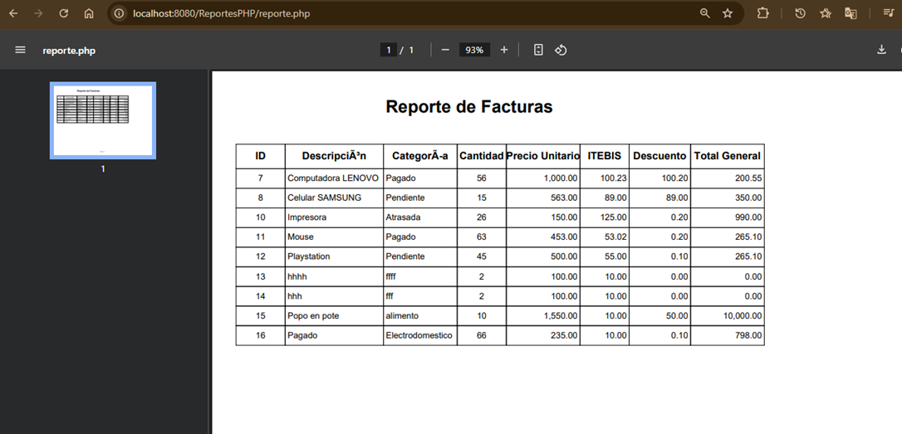

# 📝 Formulario de Factura

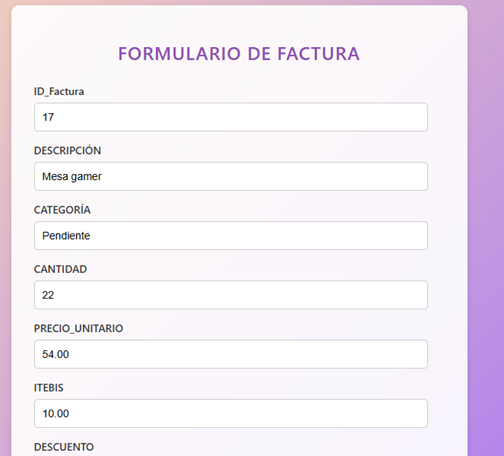

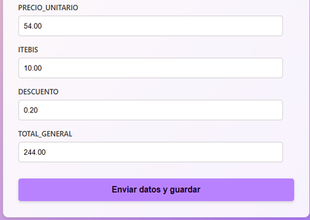
